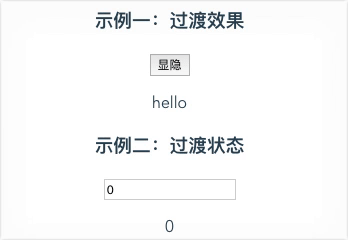

# API 进阶篇

## 数据驱动原理

通过 ES5 的 defineProperty 将 Vue 对象的属性全部转变为 getter/setter，然后配合 Dom 事件实现 Data 和 View 的双向绑定。由于属性转变为 getter/setter 只在 Vue 实例初始化时完成，所以新添加的属性不能双向绑定。而转变是在声明周期的哪一个阶段完成的呢？beforeMount 和 mounted 之间的阶段应该是正确答案，我们把他称为 mount  阶段。这个在 `src/demo/data-set.vue` Demo 中可以验证。 

如果想在组件的生命周期 mount 阶段之后再添加属性，需要使用 

    this.$set(this.someObject, 'objectAttributionName', attributionValue)

这里有一点文档中没有提到，如果一个属性对象使用了上面的方法，那么此对象会重新被转化，那些没有使用上面方法 set 的属性也会被转化。如果想添加多个属性，文档给了一个方法，使用 JS 的原生方法 Object.assign 来生成新对象替换原来的属性对象：

    this.someObject = Object.assign({}, this.someObject, { a: 1, b: 2 })

需要声明一点，上面所有添加新属性的方法都只能添加二级及以上的属性，无法添加 data 的根属性(一级属性)。

数据驱动 Dom 的改变是一个异步的过程，如果数据改变之后想要立即操作 Dom，这是的 Dom 可能还没有被更新，这是需要使用 $nextTick：

    methods: {
        updateMessage: function () {
          this.message = 'updated'
          console.log(this.$el.textContent) // => '没有更新'
          this.$nextTick(function () {
            console.log(this.$el.textContent) // => '更新完成'
          })
        }
    }

## 过渡效果和状态

过渡效果是显隐的过渡，过渡状态是值改变的过渡。

### 过渡效果

显隐的过渡分三类：v-if、v-show、数组对象中元素的增减。
先说前两种在过渡上他们并没有什么显著的差别。transition 可以有一个 name，缺省值是 v。进入和离开又各有两个状态，enter 和 leave 定义起始时的状态，enter-active 和 leave-active 定义动画过程和结束时的状态。如下面简单 Demo：`/src/demo/transition.vue`：

    Dom:
    

      <button v-on:click="show = !show">显隐</button>
      <transition>
        
hello

      </transition>
    

    
    Style:
    .v-enter-active, .v-leave-active {
      transition: opacity 3s
    }
  
    .v-enter, .v-leave-active {
      opacity: 0
    }

自定义过渡类名一般用不到，一种更好的实践是将自定义动画包装成组件。

    <transition
      name="custom-classes-transition"
      enter-active-class="animated tada"
      leave-active-class="animated bounceOutRight"
    >

同时使用 Transitions 和 Animations 时注意设置 type。(什么场景同时有过渡和动画？我没想到)

动画状态的两组钩子比较有用，可以配合 Velocity.js 实现更复杂的动画：

- beforeEnter enter afterEnter enterCancelled
- leaveEnter leave afterLeave leaveCancelled

多元素的过渡需要用到 mode="out-in"，查看示例三：多元素过渡演示。

显隐的过渡第三类表现就是数组元素的增删和改变，需要用 transition-group 来描述。

### 过渡状态

状态过渡设计的都是值变处理，所以 CSS 的动画在这里就不合适了，这里主要用到两个库：

- 数字的值变: [tween.js](https://github.com/tweenjs/tween.js)
- 颜色的值变: [color-js](https://github.com/brehaut/color-js)
 
这里需要单独学习两个库的使用，在官网的 Demo “状态动画 与 watcher” 中有一个死循环，这里修正一下：

    number: function (newValue, oldValue) {
      var vm = this
      // 递归调用
      function animate () {
        // 这里改造了官网的例子，
        // 官网上的递归调用是一个死循环
        if (TWEEN.update()) {
          requestAnimationFrame(animate)
        }
      }

      new TWEEN.Tween({tweeningNumber: oldValue})
        .easing(TWEEN.Easing.Quadratic.Out)
        .to({tweeningNumber: newValue}, 500)
        .onUpdate(function () {
          vm.animatedNumber = this.tweeningNumber.toFixed(0)
        })
        .start()

      animate()
    }

## 渲染函数

这里只讲一个问题，什么时候用自定义渲染？

对节点本身的结构有自定义需求，比如 h1 - h6 的那个例子；

React 转粉过来的，想用 JSX；

函数化组件没想到合适的应用场景，难道只是用来输出简单的静态 html 片段。

注：函数化组件只是一个函数，所以渲染开销也低很多。 

## 自定义指令

没想到自定义指令的应用场景，直接略过。

## 混合

几个注意点：

- 钩子函数会被按队列执行，混合对象的 钩子将在组件自身钩子**之前**调用，不会被覆盖；
- 值为对象的选项，例如 methods, components 和 directives，将被混合为同一个对象。 两个对象键名冲突时，取组件对象的键值对；
- 上面两条可以通过 `Vue.config.optionMergeStrategies.myOption` 自定义。

## 插件

插件的开发暂时用不到，但是有两个 Vue 插件是必须学的：vue-router 和 vuex，vue-router 是单页应用需要用到的前端路由管理器，vuex 是富交互应用的数据状态管理器。两个库都需要单独学习这里不展开。